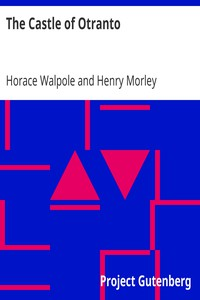

# The Castle of Otranto <kbd>v2.0.2</kbd>

## Authors

 - Walpole, Horace <small>(1717 - 1797)</small>

## Translators

## Subjects

 - Gothic fiction
 - Horror tales
 - Inheritance and succession

## Readablility

 - **A1:** 49%
 - **A2:** 55%
 - **B1:** 65%
 - **B2:** 80%
 - **C1:** 84%
 - **C2:** 100%

## Words Count

 - **A1:** 495
 - **A2:** 384
 - **B1:** 620
 - **B2:** 913
 - **C1:** 363
 - **C2:** 2074

## Source

<kbd>GUTHENBURGE:696</kbd>
