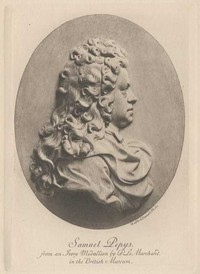

# The Diary of Samuel Pepys — Complete <kbd>v2.2.1</kbd>

## Authors

 - Pepys, Samuel <small>(1633 - 1703)</small>

## Translators

 - Bright, Mynors <small>(1818 - 1883)</small>

## Subjects

 - Cabinet officers
 - Diarists
 - Great Britain
 - Great Britain
 - Pepys, Samuel, 1633-1703

## Readablility

 - **A1:** 82%
 - **A2:** 88%
 - **B1:** 92%
 - **B2:** 96%
 - **C1:** 99%
 - **C2:** 100%

## Words Count

 - **A1:** 495
 - **A2:** 496
 - **B1:** 965
 - **B2:** 1755
 - **C1:** 2707
 - **C2:** 2545

## Source

<kbd>GUTHENBURGE:4200</kbd>
