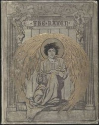

# The Raven <kbd>v2.2.1</kbd>

## Authors

 - Poe, Edgar Allan <small>(1809 - 1849)</small>

## Translators

## Subjects

 - Fantasy poetry, American
 - Ravens

## Readablility

 - **A1:** 69%
 - **A2:** 76%
 - **B1:** 83%
 - **B2:** 91%
 - **C1:** 96%
 - **C2:** 100%

## Words Count

 - **A1:** 395
 - **A2:** 248
 - **B1:** 328
 - **B2:** 461
 - **C1:** 338
 - **C2:** 199

## Source

<kbd>GUTHENBURGE:17192</kbd>
