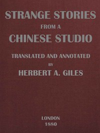

# Strange Stories from a Chinese Studio (Volumes 1 and 2) <kbd>v2.2.1</kbd>

## Authors

 - Pu, Songling <small>(1640 - 1715)</small>

## Translators

 - Giles, Herbert Allen <small>(1845 - 1935)</small>

## Subjects

 - China
 - Short stories, Chinese

## Readablility

 - **A1:** 77%
 - **A2:** 83%
 - **B1:** 89%
 - **B2:** 94%
 - **C1:** 98%
 - **C2:** 100%

## Words Count

 - **A1:** 494
 - **A2:** 495
 - **B1:** 950
 - **B2:** 1701
 - **C1:** 2315
 - **C2:** 1678

## Source

<kbd>GUTHENBURGE:43629</kbd>
