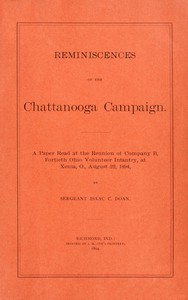

# Reminiscences of the Chattanooga campaign: A paper read at the reunion of Company B, Fortieth Ohio volunteer infantry, at Xenia, O., August 22, 1894 <kbd>v2.3.0</kbd>

## Authors

 - Doan, Isaac C. <small>(-1 - -1)</small>

## Translators

## Subjects

 - Chattanooga, Battle of, Chattanooga, Tenn., 1863
 - Chickamauga, Battle of, Ga., 1863
 - Doan, Isaac C.
 - United States
 - United States
 - United States. Army. Ohio Infantry Regiment, 40th (1861-1864)

## Readablility

 - **A1:** 69%
 - **A2:** 77%
 - **B1:** 84%
 - **B2:** 92%
 - **C1:** 98%
 - **C2:** 100%

## Words Count

 - **A1:** 409
 - **A2:** 260
 - **B1:** 349
 - **B2:** 426
 - **C1:** 373
 - **C2:** 139

## Source

<kbd>GUTHENBURGE:68095</kbd>
