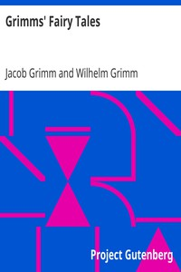

# Grimms' Fairy Tales <kbd>v2.2.0</kbd>

## Authors

 - Grimm, Wilhelm <small>(1786 - 1859)</small>
 - Grimm, Jacob <small>(1785 - 1863)</small>

## Translators

## Subjects

 - Fairy tales

## Readablility

 - **A1:** 80%
 - **A2:** 86%
 - **B1:** 91%
 - **B2:** 95%
 - **C1:** 99%
 - **C2:** 100%

## Words Count

 - **A1:** 1626
 - **A2:** 439
 - **B1:** 719
 - **B2:** 993
 - **C1:** 993
 - **C2:** 534

## Source

<kbd>GUTHENBURGE:2591</kbd>
