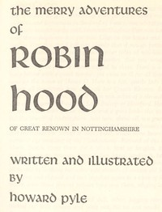

# The Merry Adventures of Robin Hood <kbd>v2.3.0</kbd>

## Authors

 - Pyle, Howard <small>(1853 - 1911)</small>

## Translators

## Subjects

 - Folklore
 - Robin Hood (Legendary character)

## Readablility

 - **A1:** 74%
 - **A2:** 80%
 - **B1:** 86%
 - **B2:** 92%
 - **C1:** 97%
 - **C2:** 100%

## Words Count

 - **A1:** 479
 - **A2:** 419
 - **B1:** 683
 - **B2:** 938
 - **C1:** 1127
 - **C2:** 807

## Source

<kbd>GUTHENBURGE:10148</kbd>
