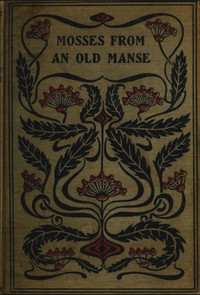

# Mosses from an Old Manse, and Other Stories <kbd>v2.2.1</kbd>

## Authors

 - Hawthorne, Nathaniel <small>(1804 - 1864)</small>

## Translators

## Subjects

 - New England
 - Short stories

## Readablility

 - **A1:** 72%
 - **A2:** 78%
 - **B1:** 85%
 - **B2:** 92%
 - **C1:** 97%
 - **C2:** 100%

## Words Count

 - **A1:** 494
 - **A2:** 482
 - **B1:** 892
 - **B2:** 1484
 - **C1:** 1857
 - **C2:** 1155

## Source

<kbd>GUTHENBURGE:512</kbd>
