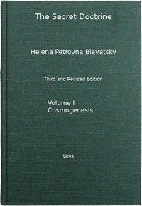

# The Secret Doctrine, Vol. 1 of 4: The Synthesis of Science, Religion, and Philosophy <kbd>v2.3.0</kbd>

## Authors

 - Blavatsky, H. P. (Helena Petrovna) <small>(1831 - 1891)</small>

## Translators

## Subjects

 - Theosophy

## Readablility

 - **A1:** 73%
 - **A2:** 78%
 - **B1:** 84%
 - **B2:** 91%
 - **C1:** 96%
 - **C2:** 100%

## Words Count

 - **A1:** 495
 - **A2:** 485
 - **B1:** 894
 - **B2:** 1585
 - **C1:** 2238
 - **C2:** 2240

## Source

<kbd>GUTHENBURGE:54824</kbd>
