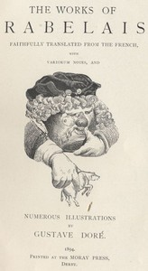

# Gargantua and Pantagruel <kbd>v2.2.1</kbd>

## Authors

 - Rabelais, François <small>(-1 - -1)</small>

## Translators

 - Motteux, Peter Anthony <small>(1660 - 1718)</small>
 - Urquhart, Thomas, Sir <small>(1611 - 1660)</small>

## Subjects

 - Fantasy fiction, French
 - Gargantua (Legendary character)
 - Giants

## Readablility

 - **A1:** 77%
 - **A2:** 81%
 - **B1:** 87%
 - **B2:** 91%
 - **C1:** 96%
 - **C2:** 100%

## Words Count

 - **A1:** 495
 - **A2:** 492
 - **B1:** 965
 - **B2:** 1774
 - **C1:** 2870
 - **C2:** 3226

## Source

<kbd>GUTHENBURGE:1200</kbd>
