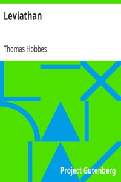

# Leviathan <kbd>GUTHENBURGE</kbd>

## Authors

 - Hobbes, Thomas <small>(1588 - 1679)</small>

## Translators

## Subjects

 - Political science
 - State, The

## Readablility

 - **A1:** 56%
 - **A2:** 67%
 - **B1:** 78%
 - **B2:** 89%
 - **C1:** 97%
 - **C2:** 100%

## Words Count

 - **A1:** 380
 - **A2:** 385
 - **B1:** 655
 - **B2:** 991
 - **C1:** 1150
 - **C2:** 748
