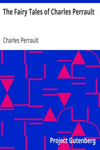

# The Fairy Tales of Charles Perrault <kbd>v2.3.0</kbd>

## Authors

 - Perrault, Charles <small>(1628 - 1703)</small>

## Translators

 - Mansion, J. E. (Jean Edmond) <small>(1870 - 1942)</small>
 - Samber, Robert <small>(-1 - -1)</small>

## Subjects

 - Fairy tales

## Readablility

 - **A1:** 76%
 - **A2:** 82%
 - **B1:** 88%
 - **B2:** 94%
 - **C1:** 98%
 - **C2:** 100%

## Words Count

 - **A1:** 485
 - **A2:** 411
 - **B1:** 626
 - **B2:** 788
 - **C1:** 710
 - **C2:** 327

## Source

<kbd>GUTHENBURGE:29021</kbd>
