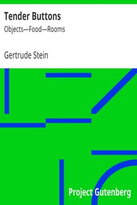

# Tender Buttons: Objects—Food—Rooms <kbd>v2.2.1</kbd>

## Authors

 - Stein, Gertrude <small>(1874 - 1946)</small>

## Translators

## Subjects

 - Prose poems

## Readablility

 - **A1:** 70%
 - **A2:** 77%
 - **B1:** 85%
 - **B2:** 92%
 - **C1:** 97%
 - **C2:** 100%

## Words Count

 - **A1:** 373
 - **A2:** 294
 - **B1:** 442
 - **B2:** 583
 - **C1:** 538
 - **C2:** 319

## Source

<kbd>GUTHENBURGE:15396</kbd>
