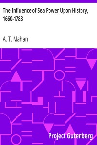

# The Influence of Sea Power Upon History, 1660-1783 <kbd>v2.2.1</kbd>

## Authors

 - Mahan, A. T. (Alfred Thayer) <small>(1840 - 1914)</small>

## Translators

## Subjects

 - Naval history, Modern
 - Sea-power

## Readablility

 - **A1:** 73%
 - **A2:** 79%
 - **B1:** 86%
 - **B2:** 93%
 - **C1:** 98%
 - **C2:** 100%

## Words Count

 - **A1:** 485
 - **A2:** 453
 - **B1:** 845
 - **B2:** 1406
 - **C1:** 1932
 - **C2:** 1329

## Source

<kbd>GUTHENBURGE:13529</kbd>
