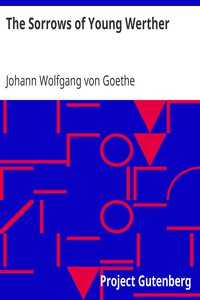

# The Sorrows of Young Werther <kbd>v2.2.1</kbd>

## Authors

 - Goethe, Johann Wolfgang von <small>(1749 - 1832)</small>

## Translators

 - Boylan, R. Dillon <small>(-1 - -1)</small>

## Subjects

 - Germany
 - Unrequited love
 - Young men

## Readablility

 - **A1:** 75%
 - **A2:** 81%
 - **B1:** 88%
 - **B2:** 94%
 - **C1:** 99%
 - **C2:** 100%

## Words Count

 - **A1:** 490
 - **A2:** 447
 - **B1:** 773
 - **B2:** 1117
 - **C1:** 1106
 - **C2:** 491

## Source

<kbd>GUTHENBURGE:2527</kbd>
