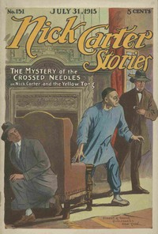

# Nick Carter Stories No. 151, July 31, 1915: The Mystery of the Crossed Needles; or Nick Carter and the Yellow Tong <kbd>v2.2.1</kbd>

## Authors

 - Carter, Nicholas (House name) <small>(-1 - -1)</small>
 - Boston, Ralph <small>(-1 - -1)</small>

## Translators

## Subjects

 - Detective and mystery stories, American
 - Popular literature

## Readablility

 - **A1:** 76%
 - **A2:** 81%
 - **B1:** 87%
 - **B2:** 92%
 - **C1:** 97%
 - **C2:** 100%

## Words Count

 - **A1:** 480
 - **A2:** 432
 - **B1:** 695
 - **B2:** 927
 - **C1:** 841
 - **C2:** 458

## Source

<kbd>GUTHENBURGE:68089</kbd>
