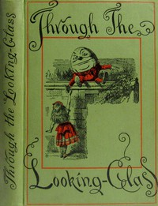

# Through the Looking-Glass <kbd>GUTHENBURGE</kbd>

## Authors

 - Carroll, Lewis <small>(1832 - 1898)</small>

## Translators

## Subjects

 - Alice (Fictitious character from Carroll)
 - Children's stories
 - Fantasy fiction
 - Imaginary places

## Readablility

 - **A1:** 53%
 - **A2:** 60%
 - **B1:** 71%
 - **B2:** 84%
 - **C1:** 88%
 - **C2:** 100%

## Words Count

 - **A1:** 453
 - **A2:** 326
 - **B1:** 527
 - **B2:** 645
 - **C1:** 267
 - **C2:** 1153

## Tagger Version

v2.0.0
