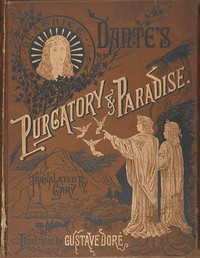

# The Divine Comedy by Dante, Illustrated, Paradise, Complete <kbd>v2.0.2</kbd>

## Authors

 - Dante Alighieri <small>(1265 - 1321)</small>

## Translators

 - Cary, Henry Francis <small>(1772 - 1844)</small>

## Subjects

 - Epic poetry, Italian
 - Italian poetry

## Readablility

 - **A1:** 43%
 - **A2:** 50%
 - **B1:** 60%
 - **B2:** 74%
 - **C1:** 79%
 - **C2:** 100%

## Words Count

 - **A1:** 451
 - **A2:** 358
 - **B1:** 610
 - **B2:** 911
 - **C1:** 400
 - **C2:** 3943

## Source

<kbd>GUTHENBURGE:8799</kbd>
