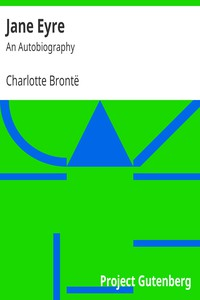

# Jane Eyre: An Autobiography <kbd>GUTHENBURGE</kbd>

## Authors

 - Brontë, Charlotte <small>(1816 - 1855)</small>

## Translators

## Subjects

 - Bildungsromans
 - Charity-schools
 - Country homes
 - England
 - Fathers and daughters
 - Governesses
 - Love stories
 - Married people
 - Mentally ill women
 - Orphans
 - Young women

## Readablility

 - **A1:** 46%
 - **A2:** 59%
 - **B1:** 72%
 - **B2:** 85%
 - **C1:** 95%
 - **C2:** 100%

## Words Count

 - **A1:** 409
 - **A2:** 484
 - **B1:** 943
 - **B2:** 1720
 - **C1:** 2559
 - **C2:** 2338
