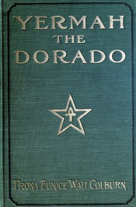

# Yermah the Dorado: The story of a lost race <kbd>v2.3.0</kbd>

## Authors

 - Wait, Frona Eunice <small>(1859 - 1946)</small>

## Translators

## Subjects

 - Fantasy fiction
 - Geographical myths

## Readablility

 - **A1:** 71%
 - **A2:** 77%
 - **B1:** 84%
 - **B2:** 90%
 - **C1:** 96%
 - **C2:** 100%

## Words Count

 - **A1:** 491
 - **A2:** 477
 - **B1:** 926
 - **B2:** 1615
 - **C1:** 2299
 - **C2:** 1972

## Source

<kbd>GUTHENBURGE:68101</kbd>
