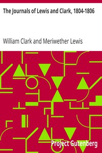

# The Journals of Lewis and Clark, 1804-1806 <kbd>v2.2.1</kbd>

## Authors

 - Lewis, Meriwether <small>(1774 - 1809)</small>
 - Clark, William <small>(1770 - 1838)</small>

## Translators

## Subjects

 - Clark, William, 1770-1838
 - Columbia River
 - Lewis and Clark Expedition (1804-1806)
 - Lewis, Meriwether, 1774-1809
 - Missouri River
 - West (U.S.)
 - West (U.S.)

## Readablility

 - **A1:** 77%
 - **A2:** 84%
 - **B1:** 90%
 - **B2:** 95%
 - **C1:** 98%
 - **C2:** 100%

## Words Count

 - **A1:** 494
 - **A2:** 473
 - **B1:** 860
 - **B2:** 1431
 - **C1:** 1935
 - **C2:** 1559

## Source

<kbd>GUTHENBURGE:8419</kbd>
