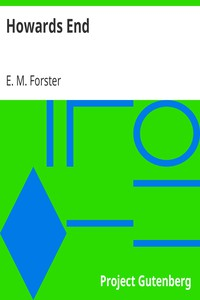

# Howards End <kbd>v2.2.1</kbd>

## Authors

 - Forster, E. M. (Edward Morgan) <small>(1879 - 1970)</small>

## Translators

## Subjects

 - Country homes
 - Domestic fiction
 - England
 - Illegitimate children
 - Inheritance and succession
 - Remarried people
 - Sisters
 - Social classes

## Readablility

 - **A1:** 79%
 - **A2:** 84%
 - **B1:** 90%
 - **B2:** 95%
 - **C1:** 98%
 - **C2:** 100%

## Words Count

 - **A1:** 493
 - **A2:** 481
 - **B1:** 907
 - **B2:** 1494
 - **C1:** 1785
 - **C2:** 1214

## Source

<kbd>GUTHENBURGE:2946</kbd>
