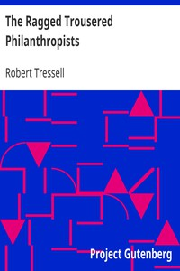

# The Ragged Trousered Philanthropists <kbd>v2.2.1</kbd>

## Authors

 - Tressell, Robert <small>(1870 - 1911)</small>

## Translators

## Subjects

 - Capitalism
 - England
 - Labor movement
 - Political fiction
 - Social classes
 - Social conflict
 - Socialists
 - Working class
 - Working class families

## Readablility

 - **A1:** 78%
 - **A2:** 83%
 - **B1:** 89%
 - **B2:** 94%
 - **C1:** 98%
 - **C2:** 100%

## Words Count

 - **A1:** 493
 - **A2:** 493
 - **B1:** 949
 - **B2:** 1660
 - **C1:** 2339
 - **C2:** 1736

## Source

<kbd>GUTHENBURGE:3608</kbd>
