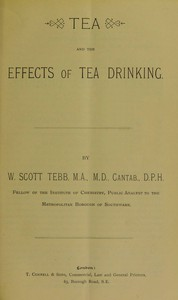

# Tea and the effects of tea drinking <kbd>v2.0.2</kbd>

## Authors

 - Tebb, W. Scott (William Scott) <small>(1862 - 1917)</small>

## Translators

## Subjects

 - Tea
 - Tea
 - Tea

## Readablility

 - **A1:** 46%
 - **A2:** 53%
 - **B1:** 66%
 - **B2:** 82%
 - **C1:** 86%
 - **C2:** 100%

## Words Count

 - **A1:** 385
 - **A2:** 294
 - **B1:** 386
 - **B2:** 515
 - **C1:** 187
 - **C2:** 915

## Source

<kbd>GUTHENBURGE:68148</kbd>
