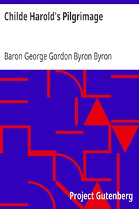

# Childe Harold's Pilgrimage <kbd>v2.3.0</kbd>

## Authors

 - Byron, George Gordon Byron, Baron <small>(1788 - 1824)</small>

## Translators

## Subjects

 - English poetry
 - Pilgrims and pilgrimages
 - Voyages and travels

## Readablility

 - **A1:** 70%
 - **A2:** 75%
 - **B1:** 82%
 - **B2:** 90%
 - **C1:** 96%
 - **C2:** 100%

## Words Count

 - **A1:** 455
 - **A2:** 362
 - **B1:** 609
 - **B2:** 957
 - **C1:** 1189
 - **C2:** 930

## Source

<kbd>GUTHENBURGE:5131</kbd>
