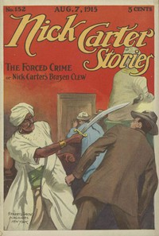

# Nick Carter Stories No. 152, August 7, 1915: The Forced Crime; or, Nick Carter's Brazen Clew. <kbd>v2.3.0</kbd>

## Authors

 - Carter, Nicholas (House name) <small>(-1 - -1)</small>
 - Boston, Ralph <small>(-1 - -1)</small>

## Translators

## Subjects

 - Detective and mystery stories, American
 - Popular literature

## Readablility

 - **A1:** 75%
 - **A2:** 81%
 - **B1:** 87%
 - **B2:** 92%
 - **C1:** 98%
 - **C2:** 100%

## Words Count

 - **A1:** 488
 - **A2:** 438
 - **B1:** 719
 - **B2:** 979
 - **C1:** 912
 - **C2:** 517

## Source

<kbd>GUTHENBURGE:68106</kbd>
