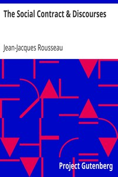

# The Social Contract & Discourses <kbd>v2.0.2</kbd>

## Authors

 - Rousseau, Jean-Jacques <small>(1712 - 1778)</small>

## Translators

 - Cole, G. D. H. (George Douglas Howard) <small>(1889 - 1959)</small>

## Subjects

 - Economics
 - Political science
 - Social contract

## Readablility

 - **A1:** 53%
 - **A2:** 61%
 - **B1:** 73%
 - **B2:** 87%
 - **C1:** 91%
 - **C2:** 100%

## Words Count

 - **A1:** 604
 - **A2:** 616
 - **B1:** 998
 - **B2:** 1622
 - **C1:** 645
 - **C2:** 4377

## Source

<kbd>GUTHENBURGE:46333</kbd>
