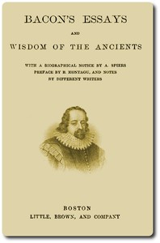

# Bacon's Essays, and Wisdom of the Ancients <kbd>v2.3.0</kbd>

## Authors

 - Bacon, Francis <small>(1561 - 1626)</small>

## Translators

## Subjects

 - Bacon, Francis, 1561-1626
 - English essays
 - Mythology, Classical

## Readablility

 - **A1:** 75%
 - **A2:** 80%
 - **B1:** 86%
 - **B2:** 92%
 - **C1:** 97%
 - **C2:** 100%

## Words Count

 - **A1:** 493
 - **A2:** 475
 - **B1:** 917
 - **B2:** 1511
 - **C1:** 2028
 - **C2:** 1516

## Source

<kbd>GUTHENBURGE:56463</kbd>
