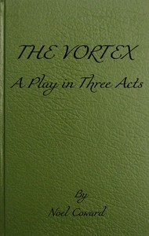

# The Vortex: A Play in Three Acts <kbd>v2.2.1</kbd>

## Authors

 - Coward, Noel <small>(1899 - 1973)</small>

## Translators

## Subjects

 - Drug addicts
 - England
 - Man-woman relationships
 - Mothers and sons

## Readablility

 - **A1:** 78%
 - **A2:** 85%
 - **B1:** 90%
 - **B2:** 95%
 - **C1:** 99%
 - **C2:** 100%

## Words Count

 - **A1:** 437
 - **A2:** 285
 - **B1:** 383
 - **B2:** 458
 - **C1:** 369
 - **C2:** 169

## Source

<kbd>GUTHENBURGE:67988</kbd>
