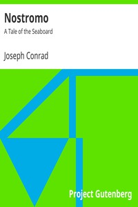

# Nostromo: A Tale of the Seaboard <kbd>v2.3.0</kbd>

## Authors

 - Conrad, Joseph <small>(1857 - 1924)</small>

## Translators

## Subjects

 - Latin America
 - Political fiction
 - Revolutions
 - Sailors
 - Sea stories

## Readablility

 - **A1:** 75%
 - **A2:** 81%
 - **B1:** 87%
 - **B2:** 93%
 - **C1:** 97%
 - **C2:** 100%

## Words Count

 - **A1:** 492
 - **A2:** 488
 - **B1:** 949
 - **B2:** 1689
 - **C1:** 2452
 - **C2:** 1989

## Source

<kbd>GUTHENBURGE:2021</kbd>
