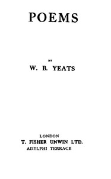

# Poems <kbd>v2.2.1</kbd>

## Authors

 - Yeats, W. B. (William Butler) <small>(1865 - 1939)</small>

## Translators

## Subjects

 - English drama
 - English poetry

## Readablility

 - **A1:** 74%
 - **A2:** 80%
 - **B1:** 87%
 - **B2:** 93%
 - **C1:** 98%
 - **C2:** 100%

## Words Count

 - **A1:** 475
 - **A2:** 382
 - **B1:** 580
 - **B2:** 804
 - **C1:** 818
 - **C2:** 523

## Source

<kbd>GUTHENBURGE:38877</kbd>
