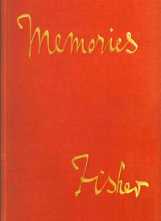

# Memories, by Admiral of the Fleet Lord Fisher <kbd>v2.2.1</kbd>

## Authors

 - Fisher, John Arbuthnot Fisher, Baron <small>(1841 - 1920)</small>

## Translators

## Subjects

 - Admirals
 - Fisher, John Arbuthnot Fisher, Baron, 1841-1920
 - Great Britain. Royal Navy

## Readablility

 - **A1:** 76%
 - **A2:** 81%
 - **B1:** 87%
 - **B2:** 92%
 - **C1:** 97%
 - **C2:** 100%

## Words Count

 - **A1:** 491
 - **A2:** 484
 - **B1:** 849
 - **B2:** 1296
 - **C1:** 1475
 - **C2:** 1041

## Source

<kbd>GUTHENBURGE:68034</kbd>
