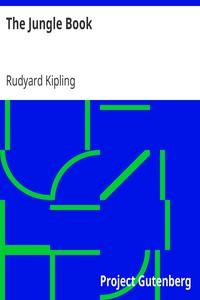

# The Jungle Book <kbd>v2.2.1</kbd>

## Authors

 - Kipling, Rudyard <small>(1865 - 1936)</small>

## Translators

## Subjects

 - Adventure stories, English
 - Animals
 - Feral children
 - India
 - India
 - Jungle animals
 - Jungles
 - Mowgli (Fictitious character)
 - Short stories

## Readablility

 - **A1:** 77%
 - **A2:** 83%
 - **B1:** 88%
 - **B2:** 93%
 - **C1:** 98%
 - **C2:** 100%

## Words Count

 - **A1:** 483
 - **A2:** 402
 - **B1:** 627
 - **B2:** 791
 - **C1:** 789
 - **C2:** 518

## Source

<kbd>GUTHENBURGE:236</kbd>
