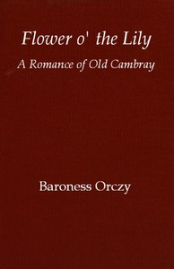

# Flower o' the lily: A romance of old Cambray <kbd>v2.3.0</kbd>

## Authors

 - Orczy, Emmuska Orczy, Baroness <small>(1865 - 1947)</small>

## Translators

## Subjects

 - Cambrai (France)

## Readablility

 - **A1:** 75%
 - **A2:** 81%
 - **B1:** 87%
 - **B2:** 92%
 - **C1:** 97%
 - **C2:** 100%

## Words Count

 - **A1:** 494
 - **A2:** 476
 - **B1:** 881
 - **B2:** 1482
 - **C1:** 1943
 - **C2:** 1601

## Source

<kbd>GUTHENBURGE:68135</kbd>
