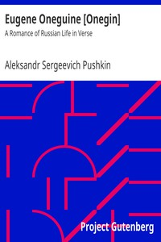

# Eugene Oneguine [Onegin]: A Romance of Russian Life in Verse <kbd>v2.3.0</kbd>

## Authors

 - Pushkin, Aleksandr Sergeevich <small>(1799 - 1837)</small>

## Translators

 - Spalding, Henry <small>(-1 - -1)</small>

## Subjects

 - Novels in verse
 - Russia

## Readablility

 - **A1:** 69%
 - **A2:** 75%
 - **B1:** 82%
 - **B2:** 90%
 - **C1:** 96%
 - **C2:** 100%

## Words Count

 - **A1:** 491
 - **A2:** 441
 - **B1:** 779
 - **B2:** 1218
 - **C1:** 1407
 - **C2:** 1108

## Source

<kbd>GUTHENBURGE:23997</kbd>
