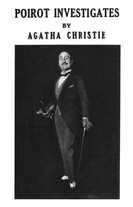

# Poirot Investigates <kbd>v2.3.0</kbd>

## Authors

 - Christie, Agatha <small>(1890 - 1976)</small>

## Translators

## Subjects

 - Belgians
 - Detective and mystery stories, English
 - Poirot, Hercule (Fictitious character)
 - Private investigators

## Readablility

 - **A1:** 76%
 - **A2:** 82%
 - **B1:** 88%
 - **B2:** 93%
 - **C1:** 98%
 - **C2:** 100%

## Words Count

 - **A1:** 489
 - **A2:** 450
 - **B1:** 789
 - **B2:** 1114
 - **C1:** 1065
 - **C2:** 647

## Source

<kbd>GUTHENBURGE:61262</kbd>
