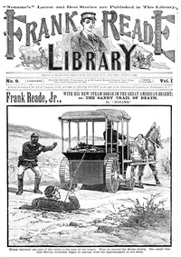

# Frank Reade, Jr., with his new steam horse in the great American desert: or, The sandy trail of death <kbd>v2.2.1</kbd>

## Authors

 - Senarens, Luis <small>(1863 - 1939)</small>

## Translators

## Subjects

 - Adventure stories
 - American fiction
 - Dime novels
 - Inventors
 - Popular literature
 - Science fiction
 - Western stories

## Readablility

 - **A1:** 72%
 - **A2:** 78%
 - **B1:** 86%
 - **B2:** 92%
 - **C1:** 98%
 - **C2:** 100%

## Words Count

 - **A1:** 461
 - **A2:** 351
 - **B1:** 540
 - **B2:** 644
 - **C1:** 580
 - **C2:** 279

## Source

<kbd>GUTHENBURGE:68067</kbd>
