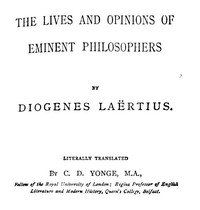

# The Lives and Opinions of Eminent Philosophers <kbd>v2.2.1</kbd>

## Authors

 - Diogenes Laertius <small>(-1 - -1)</small>

## Translators

 - Yonge, Charles Duke <small>(1812 - 1891)</small>

## Subjects

 - Philosophers, Ancient
 - Philosophy, Ancient

## Readablility

 - **A1:** 79%
 - **A2:** 84%
 - **B1:** 89%
 - **B2:** 94%
 - **C1:** 98%
 - **C2:** 100%

## Words Count

 - **A1:** 491
 - **A2:** 475
 - **B1:** 882
 - **B2:** 1477
 - **C1:** 1882
 - **C2:** 1326

## Source

<kbd>GUTHENBURGE:57342</kbd>
