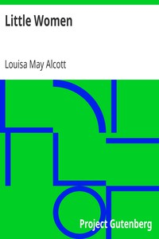

# Little Women <kbd>v2.1.0</kbd>

## Authors

 - Alcott, Louisa May <small>(1832 - 1888)</small>

## Translators

## Subjects

 - Autobiographical fiction
 - Bildungsromans
 - Domestic fiction
 - Family life
 - March family (Fictitious characters)
 - Mothers and daughters
 - New England
 - Sisters
 - Young women

## Readablility

 - **A1:** 69%
 - **A2:** 74%
 - **B1:** 80%
 - **B2:** 85%
 - **C1:** 86%
 - **C2:** 100%

## Words Count

 - **A1:** 892
 - **A2:** 689
 - **B1:** 1152
 - **B2:** 1546
 - **C1:** 611
 - **C2:** 6632

## Source

<kbd>GUTHENBURGE:514</kbd>
