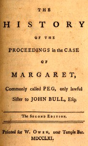

# The history of the proceedings in the case of Margaret, commonly called Peg, only lawful sister to John Bull, Esq. <kbd>v2.3.0</kbd>

## Authors

 - Ferguson, Adam <small>(1723 - 1816)</small>

## Translators

## Subjects

 - England
 - Great Britain
 - Scotland

## Readablility

 - **A1:** 78%
 - **A2:** 84%
 - **B1:** 89%
 - **B2:** 94%
 - **C1:** 98%
 - **C2:** 100%

## Words Count

 - **A1:** 459
 - **A2:** 350
 - **B1:** 535
 - **B2:** 667
 - **C1:** 581
 - **C2:** 266

## Source

<kbd>GUTHENBURGE:68133</kbd>
