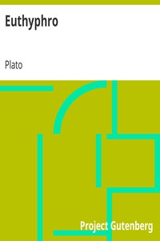

# Euthyphro <kbd>v2.3.0</kbd>

## Authors

 - Plato <small>(-428 - -348)</small>

## Translators

 - Jowett, Benjamin <small>(1817 - 1893)</small>

## Subjects

 - Classical literature
 - Philosophy, Ancient
 - Piety
 - Socrates, 470 BC-399 BC

## Readablility

 - **A1:** 77%
 - **A2:** 83%
 - **B1:** 89%
 - **B2:** 94%
 - **C1:** 99%
 - **C2:** 100%

## Words Count

 - **A1:** 364
 - **A2:** 213
 - **B1:** 301
 - **B2:** 334
 - **C1:** 230
 - **C2:** 88

## Source

<kbd>GUTHENBURGE:1642</kbd>
