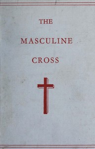

# Phallic Worship: A description of the mysteries of the sex worship of the ancients, with the history of the masculine cross. An account of primitive symbolism, Hebrew phallicism, bacchic festivals, sexual rites, and the mysteries of the ancient faiths. <kbd>v2.0.9</kbd>

## Authors

 - Jennings, Hargrave <small>(-1 - 1890)</small>

## Translators

## Subjects

 - Phallicism

## Readablility

 - **A1:** 61%
 - **A2:** 68%
 - **B1:** 74%
 - **B2:** 81%
 - **C1:** 83%
 - **C2:** 100%

## Words Count

 - **A1:** 605
 - **A2:** 378
 - **B1:** 502
 - **B2:** 581
 - **C1:** 179
 - **C2:** 1819

## Source

<kbd>GUTHENBURGE:67969</kbd>
