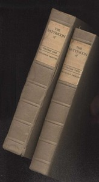

# The Satyricon — Complete <kbd>v2.0.2</kbd>

## Authors

 - Petronius Arbiter <small>(20 - 66)</small>

## Translators

 - Firebaugh, W. C. <small>(-1 - -1)</small>

## Subjects

 - Rome
 - Satire, Latin

## Readablility

 - **A1:** 50%
 - **A2:** 57%
 - **B1:** 67%
 - **B2:** 81%
 - **C1:** 84%
 - **C2:** 100%

## Words Count

 - **A1:** 613
 - **A2:** 618
 - **B1:** 1111
 - **B2:** 1860
 - **C1:** 813
 - **C2:** 7361

## Source

<kbd>GUTHENBURGE:5225</kbd>
