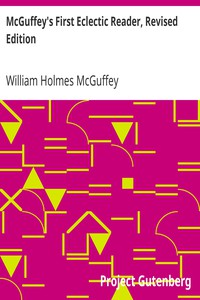

# McGuffey's First Eclectic Reader, Revised Edition <kbd>v2.3.0</kbd>

## Authors

 - McGuffey, William Holmes <small>(1800 - 1873)</small>

## Translators

## Subjects

 - Readers

## Readablility

 - **A1:** 71%
 - **A2:** 78%
 - **B1:** 86%
 - **B2:** 92%
 - **C1:** 98%
 - **C2:** 100%

## Words Count

 - **A1:** 362
 - **A2:** 198
 - **B1:** 252
 - **B2:** 270
 - **C1:** 202
 - **C2:** 99

## Source

<kbd>GUTHENBURGE:14640</kbd>
