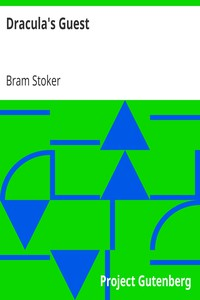

# Dracula's Guest <kbd>v2.3.0</kbd>

## Authors

 - Stoker, Bram <small>(1847 - 1912)</small>

## Translators

## Subjects

 - Gothic fiction
 - Horror tales
 - Short stories

## Readablility

 - **A1:** 77%
 - **A2:** 83%
 - **B1:** 89%
 - **B2:** 94%
 - **C1:** 98%
 - **C2:** 100%

## Words Count

 - **A1:** 491
 - **A2:** 460
 - **B1:** 831
 - **B2:** 1181
 - **C1:** 1210
 - **C2:** 715

## Source

<kbd>GUTHENBURGE:10150</kbd>
