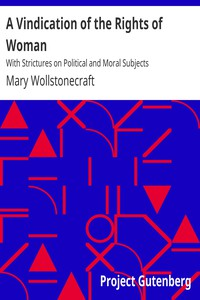

# A Vindication of the Rights of Woman: With Strictures on Political and Moral Subjects <kbd>v2.3.0</kbd>

## Authors

 - Wollstonecraft, Mary <small>(1759 - 1797)</small>

## Translators

## Subjects

 - Feminism
 - Women
 - Women
 - Women's rights

## Readablility

 - **A1:** 71%
 - **A2:** 77%
 - **B1:** 84%
 - **B2:** 91%
 - **C1:** 97%
 - **C2:** 100%

## Words Count

 - **A1:** 486
 - **A2:** 444
 - **B1:** 784
 - **B2:** 1245
 - **C1:** 1564
 - **C2:** 1194

## Source

<kbd>GUTHENBURGE:3420</kbd>
