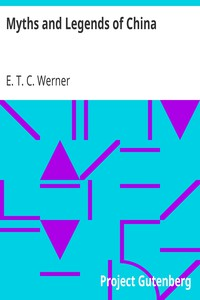

# Myths and Legends of China <kbd>v2.2.1</kbd>

## Authors

 - Werner, E. T. C. (Edward Theodore Chalmers) <small>(1864 - 1954)</small>

## Translators

## Subjects

 - Legends
 - Mythology, Chinese
 - Tales

## Readablility

 - **A1:** 73%
 - **A2:** 78%
 - **B1:** 85%
 - **B2:** 91%
 - **C1:** 97%
 - **C2:** 100%

## Words Count

 - **A1:** 490
 - **A2:** 487
 - **B1:** 929
 - **B2:** 1631
 - **C1:** 2106
 - **C2:** 1523

## Source

<kbd>GUTHENBURGE:15250</kbd>
