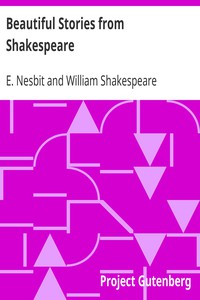

# Beautiful Stories from Shakespeare <kbd>v2.3.0</kbd>

## Authors

 - Shakespeare, William <small>(1564 - 1616)</small>
 - Nesbit, E. (Edith) <small>(1858 - 1924)</small>

## Translators

## Subjects

 - Children's literature
 - Shakespeare, William, 1564-1616

## Readablility

 - **A1:** 78%
 - **A2:** 84%
 - **B1:** 90%
 - **B2:** 95%
 - **C1:** 98%
 - **C2:** 100%

## Words Count

 - **A1:** 489
 - **A2:** 458
 - **B1:** 751
 - **B2:** 1034
 - **C1:** 960
 - **C2:** 499

## Source

<kbd>GUTHENBURGE:1430</kbd>
