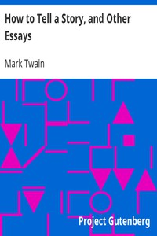

# How to Tell a Story, and Other Essays <kbd>v2.3.0</kbd>

## Authors

 - Twain, Mark <small>(1835 - 1910)</small>

## Translators

## Subjects

 - Essays
 - Short stories
 - Storytelling

## Readablility

 - **A1:** 75%
 - **A2:** 81%
 - **B1:** 88%
 - **B2:** 94%
 - **C1:** 99%
 - **C2:** 100%

## Words Count

 - **A1:** 428
 - **A2:** 268
 - **B1:** 344
 - **B2:** 370
 - **C1:** 278
 - **C2:** 105

## Source

<kbd>GUTHENBURGE:3250</kbd>
