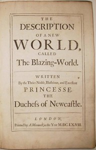

# The Description of a New World, Called the Blazing-World <kbd>v2.3.0</kbd>

## Authors

 - Newcastle, Margaret Cavendish, Duchess of <small>(-1 - 1674)</small>

## Translators

## Subjects

 - Science fiction
 - Utopias
 - Voyages, Imaginary

## Readablility

 - **A1:** 76%
 - **A2:** 82%
 - **B1:** 88%
 - **B2:** 94%
 - **C1:** 98%
 - **C2:** 100%

## Words Count

 - **A1:** 461
 - **A2:** 371
 - **B1:** 596
 - **B2:** 775
 - **C1:** 670
 - **C2:** 313

## Source

<kbd>GUTHENBURGE:51783</kbd>
